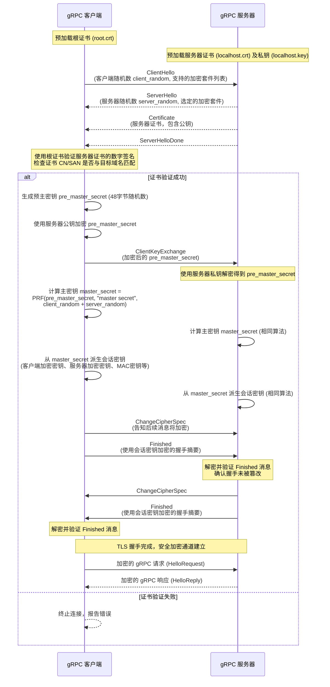

# SSL安全握手流程

```mermaid
sequenceDiagram
    participant Client as gRPC 客户端
    participant Server as gRPC 服务器

    Note over Client: 预加载根证书 (root.crt)
    Note over Server: 预加载服务器证书 (localhost.crt) 及私钥 (localhost.key)

    Client->>Server: ClientHello<br/>(客户端随机数 client_random, 支持的加密套件列表)
    Server-->>Client: ServerHello<br/>(服务器随机数 server_random, 选定的加密套件)
    Server-->>Client: Certificate<br/>(服务器证书，包含公钥)
    Server-->>Client: ServerHelloDone

    Note over Client: 使用根证书验证服务器证书的数字签名<br/>检查证书 CN/SAN 是否与目标域名匹配

    alt 证书验证成功
        Client->>Client: 生成预主密钥 pre_master_secret (48字节随机数)
        Client->>Client: 使用服务器公钥加密 pre_master_secret
        Client->>Server: ClientKeyExchange<br/>(加密后的 pre_master_secret)

        Note over Server: 使用服务器私钥解密得到 pre_master_secret

        Client->>Client: 计算主密钥 master_secret =<br/>PRF(pre_master_secret, "master secret",<br/>client_random + server_random)
        Server->>Server: 计算主密钥 master_secret (相同算法)

        Client->>Client: 从 master_secret 派生会话密钥<br/>(客户端加密密钥、服务器加密密钥、MAC密钥等)
        Server->>Server: 从 master_secret 派生会话密钥 (相同算法)

        Client->>Server: ChangeCipherSpec<br/>(告知后续消息将加密)
        Client->>Server: Finished<br/>(使用会话密钥加密的握手摘要)

        Note over Server: 解密并验证 Finished 消息<br/>确认握手未被篡改

        Server->>Client: ChangeCipherSpec
        Server->>Client: Finished<br/>(使用会话密钥加密的握手摘要)

        Note over Client: 解密并验证 Finished 消息

        Note over Client,Server: TLS 握手完成，安全加密通道建立

        Client->>Server: 加密的 gRPC 请求 (HelloRequest)
        Server-->>Client: 加密的 gRPC 响应 (HelloReply)

    else 证书验证失败
        Client-->>Client: 终止连接，报告错误
    end
```