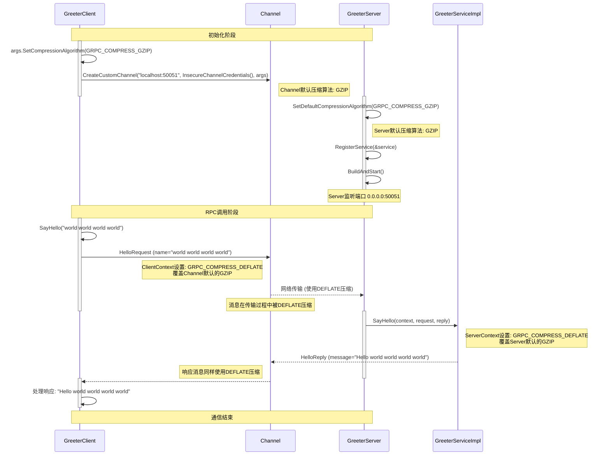

# 示例程序时序图

```mermaid
sequenceDiagram
    participant Client as GreeterClient
    participant Channel as Channel
    participant Server as GreeterServer
    participant Service as GreeterServiceImpl

    Note over Client,Server: 初始化阶段

    activate Client
    Client->>Client: args.SetCompressionAlgorithm(GRPC_COMPRESS_GZIP);
    Client->>Channel: CreateCustomChannel("localhost:50051", InsecureChannelCredentials(), args)
    Note right of Channel: Channel默认压缩算法: GZIP
    deactivate Client

    activate Server
    Server->>Server: SetDefaultCompressionAlgorithm(GRPC_COMPRESS_GZIP)
    Note right of Server: Server默认压缩算法: GZIP
    Server->>Server: RegisterService(&service)
    Server->>Server: BuildAndStart()
    Note over Server: Server监听端口 0.0.0.0:50051
    deactivate Server

    Note over Client,Server: RPC调用阶段

    activate Client
    Client->>Client: SayHello("world world world world")
    Client->>Channel: HelloRequest (name="world world world world")
    Note left of Channel: ClientContext设置: GRPC_COMPRESS_DEFLATE<br/>覆盖Channel默认的GZIP
    Channel-->>Server: 网络传输 (使用DEFLATE压缩)
    Note over Channel: 消息在传输过程中被DEFLATE压缩
    deactivate Client

    activate Server
    Server->>Service: SayHello(context, request, reply)
    Note right of Service: ServerContext设置: GRPC_COMPRESS_DEFLATE<br/>覆盖Server默认的GZIP
    Service-->>Channel: HelloReply (message="Hello world world world world")
    Note left of Channel: 响应消息同样使用DEFLATE压缩
    deactivate Server

    activate Client
    Channel-->>Client: 
    Client->>Client: 处理响应: "Hello world world world world"
    deactivate Client

    Note over Client,Server: 通信结束
```