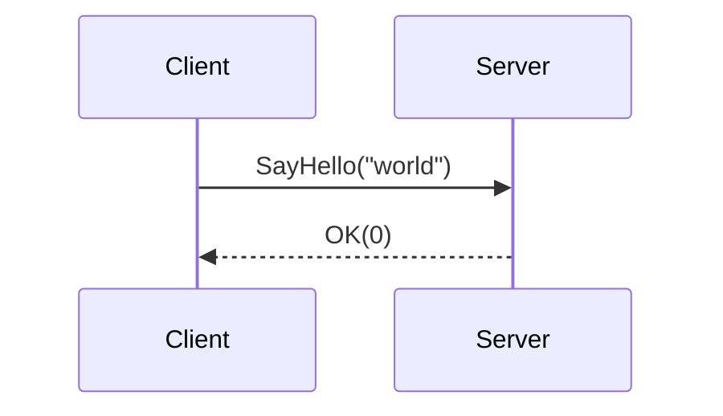
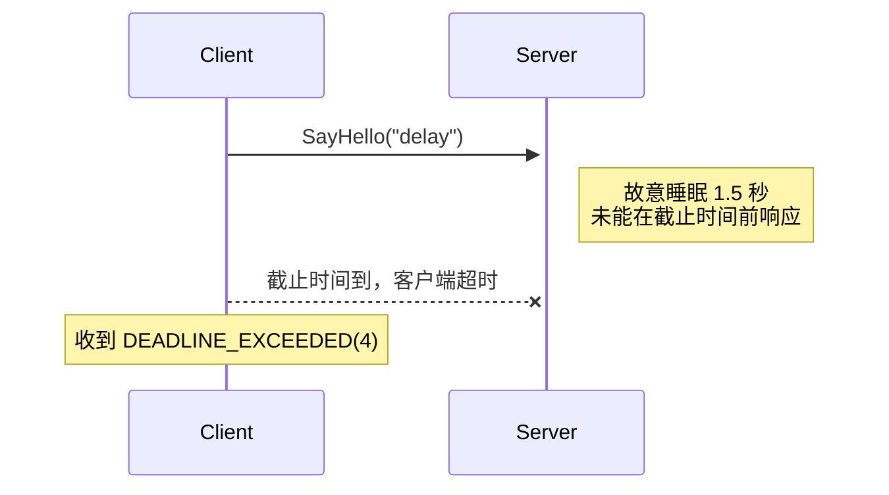
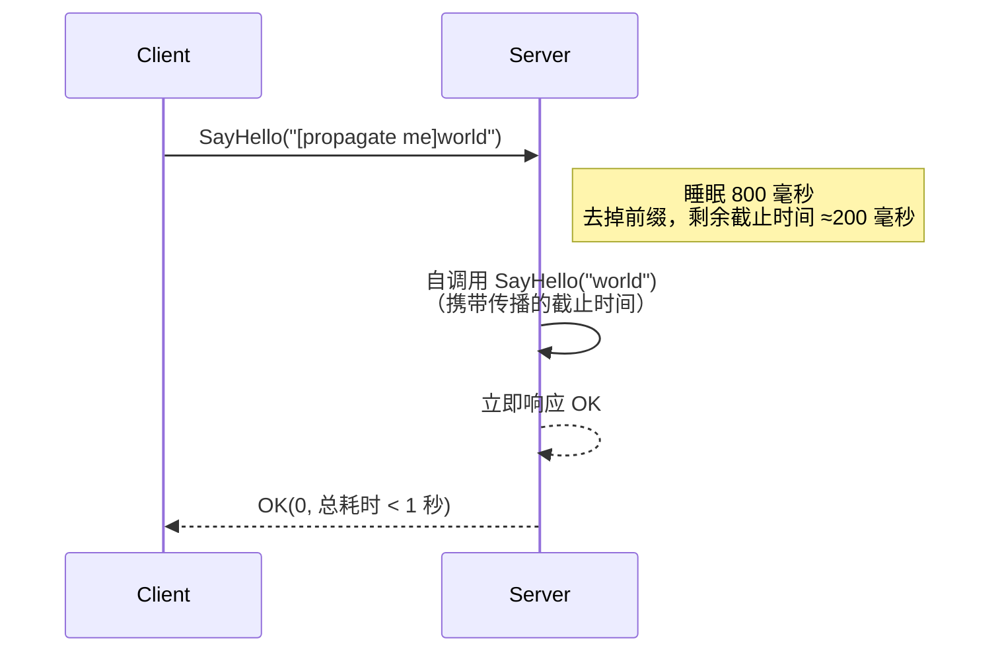
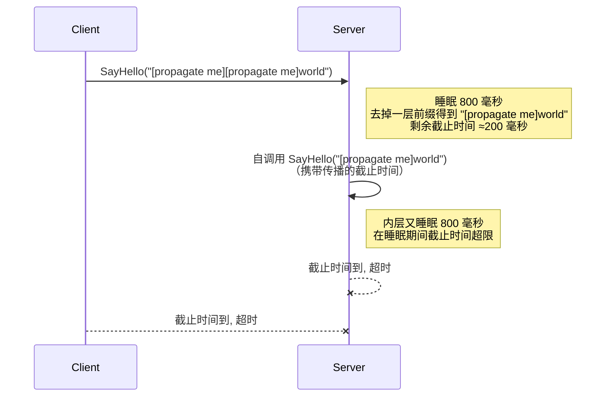

# Successful request

```mermaid
sequenceDiagram
    participant Client
    participant Server
    Client->>Server: SayHello("world")
    Server-->>Client: OK(0)
```

# Exceeds deadline

```mermaid
sequenceDiagram
    participant Client
    participant Server
    Client->>+Server: SayHello("delay")
    Note right of Server: 故意睡眠 1.5 秒<br/>未能在截止时间前响应
    Client--xServer: 截止时间到，客户端超时
    Note over Client: 收到 DEADLINE_EXCEEDED(4)
```

# Successful request with propagated deadline

```mermaid
sequenceDiagram
    participant Client
    participant Server
    Client->>Server: SayHello("[propagate me]world")
    Note right of Server: 睡眠 800 毫秒<br/>去掉前缀，剩余截止时间 ≈200 毫秒
    Server->>Server: 自调用 SayHello("world")<br/>（携带传播的截止时间）
    Server-->>Server: 立即响应 OK
    Server-->>Client: OK(0, 总耗时 < 1 秒)
```

# Exceeds propagated deadline

```mermaid
sequenceDiagram
    participant Client
    participant Server
    Client->>Server: SayHello("[propagate me][propagate me]world")
    Note right of Server: 睡眠 800 毫秒<br/>去掉一层前缀得到 "[propagate me]world"<br/>剩余截止时间 ≈200 毫秒
    Server->>Server: 自调用 SayHello("[propagate me]world")<br/>（携带传播的截止时间）
    Note right of Server: 内层又睡眠 800 毫秒<br/>在睡眠期间截止时间超限
    Server--xServer: 截止时间到, 超时
    Client--xServer: 截止时间到, 超时
```