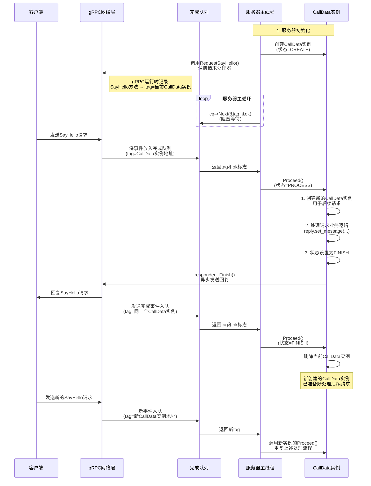
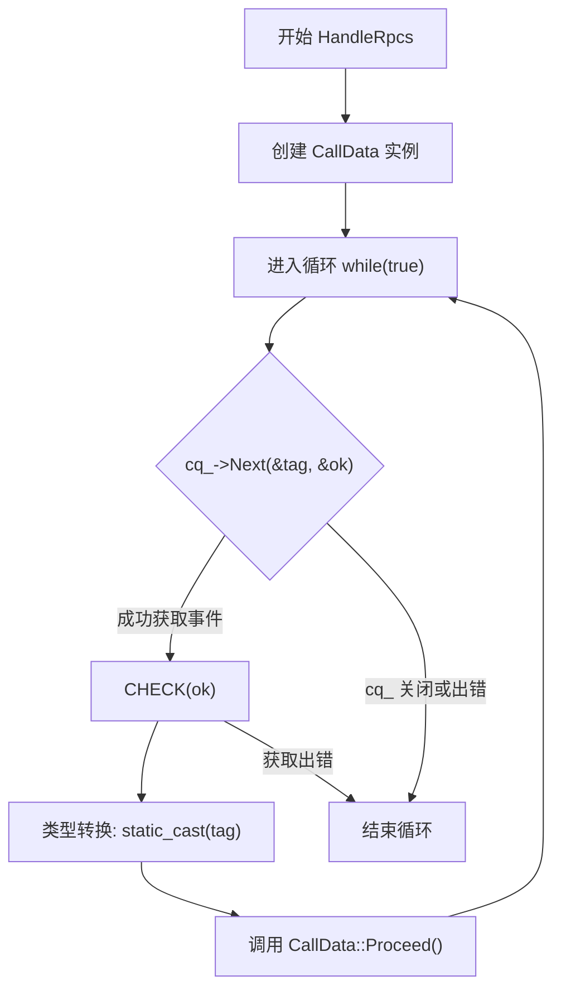
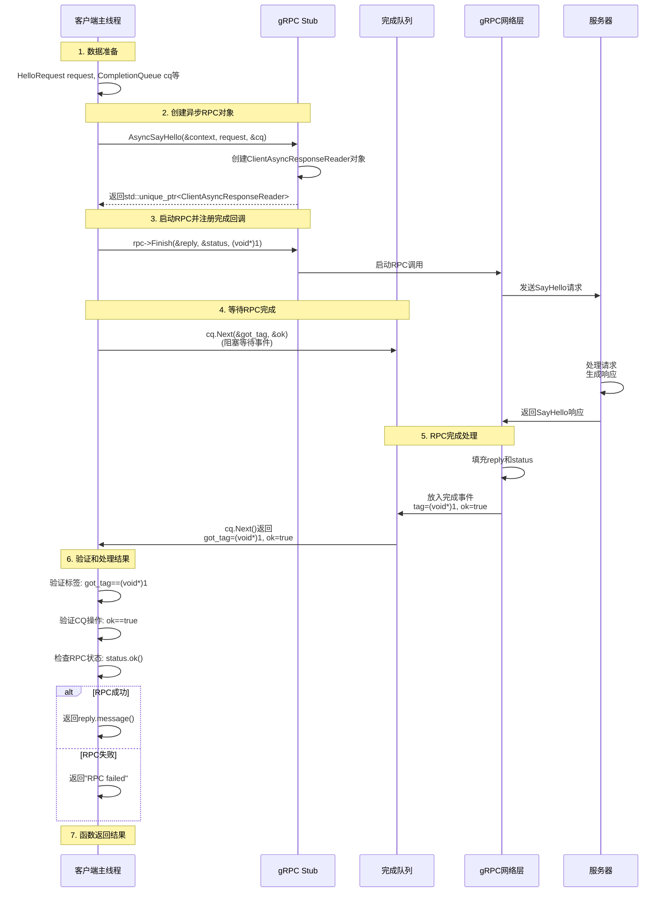

# 处理请求流程

```mermaid
sequenceDiagram
    participant Client as 客户端
    participant Network as gRPC网络层
    participant CQ as 完成队列
    participant ServerThread as 服务器主线程
    participant CallData as CallData实例

    %% 服务器启动阶段
    Note over ServerThread,CallData: 1. 服务器初始化
    ServerThread->>CallData: 创建CallData实例<br/>(状态=CREATE)
    CallData->>Network: 调用RequestSayHello()<br/>注册请求处理器
    Note right of Network: gRPC运行时记录:<br/>SayHello方法 → tag=当前CallData实例
    
    %% 等待请求阶段
    loop 服务器主循环
        ServerThread->>CQ: cq->Next(&tag, &ok)<br/>(阻塞等待)
    end
    
    %% 请求到达阶段
    Client->>Network: 发送SayHello请求
    Network->>CQ: 将事件放入完成队列<br/>(tag=CallData实例地址)
    
    %% 请求处理阶段
    CQ->>ServerThread: 返回tag和ok标志
    ServerThread->>CallData: Proceed()<br/>(状态=PROCESS)
    
    %% PROCESS状态处理
    CallData->>CallData: 1. 创建新的CallData实例<br/>用于后续请求
    CallData->>CallData: 2. 处理请求业务逻辑<br/>reply.set_message(...)
    CallData->>CallData: 3. 状态设置为FINISH
    CallData->>Network: responder_.Finish()<br/>异步发送回复
    
    %% 给客户端回包
    Network->>Client: 回复SayHello请求
    
    %% 回复发送完成阶段
    Network->>CQ: 发送完成事件入队<br/>(tag=同一个CallData实例)
    CQ->>ServerThread: 返回tag和ok标志
    ServerThread->>CallData: Proceed()<br/>(状态=FINISH)
    
    %% FINISH状态清理
    CallData->>CallData: 删除当前CallData实例
    
    %% 新请求处理流程
    Note over CallData: 新创建的CallData实例<br/>已准备好处理后续请求
    Client->>Network: 发送新的SayHello请求
    Network->>CQ: 新事件入队<br/>(tag=新CallData实例地址)
    CQ->>ServerThread: 返回新tag
    ServerThread->>CallData: 调用新实例的Proceed()<br/>重复上述处理流程
```

# HandleRpcs主流程

```mermaid
flowchart TD
    A["开始 HandleRpcs"] --> B["创建 CallData 实例"]
    B --> C["进入循环 while(true)"]
    C --> D{"cq_->Next(&tag, &ok)"}
    
    D -->|成功获取事件| E["CHECK(ok)"]
    E --> F["类型转换: static_cast<CallData*>(tag)"]
    F --> G["调用 CallData::Proceed()"]
    G --> C
    
    D -->|cq_ 关闭或出错| H["结束循环"]
    E --> |获取出错| H
```

# 客户端发送消息流程

```mermaid
sequenceDiagram
    participant ClientMain as 客户端主线程
    participant Stub as gRPC Stub
    participant CQ as 完成队列
    participant Network as gRPC网络层
    participant Server as 服务器

    %% 数据准备阶段
    Note over ClientMain: 1. 数据准备
    ClientMain->>ClientMain: HelloRequest request, CompletionQueue cq等

    %% 创建异步RPC对象
    Note over ClientMain,Stub: 2. 创建异步RPC对象
    ClientMain->>Stub: AsyncSayHello(&context, request, &cq)
    Stub->>Stub: 创建ClientAsyncResponseReader对象
    Stub-->>ClientMain: 返回std::unique_ptr<ClientAsyncResponseReader>
    
    %% 启动RPC并注册回调
    Note over ClientMain,Stub: 3. 启动RPC并注册完成回调
    ClientMain->>Stub: rpc->Finish(&reply, &status, (void*)1)
    Stub->>Network: 启动RPC调用
    
    Network->>Server: 发送SayHello请求
    
    %% 客户端等待响应
    Note over ClientMain,CQ: 4. 等待RPC完成
    ClientMain->>CQ: cq.Next(&got_tag, &ok)<br/>(阻塞等待事件)
    
    %% 服务器处理请求
    Server->>Server: 处理请求<br/>生成响应
    
    %% 服务器返回响应
    Server->>Network: 返回SayHello响应
    
    %% gRPC运行时填充结果并通知
    Note over Network,CQ: 5. RPC完成处理
    Network->>Network: 填充reply和status
    Network->>CQ: 放入完成事件<br/>tag=(void*)1, ok=true
    
    %% 客户端收到完成事件
    CQ->>ClientMain: cq.Next()返回<br/>got_tag=(void*)1, ok=true
    
    %% 客户端验证并处理结果
    Note over ClientMain: 6. 验证和处理结果
    ClientMain->>ClientMain: 验证标签: got_tag==(void*)1
    ClientMain->>ClientMain: 验证CQ操作: ok==true
    ClientMain->>ClientMain: 检查RPC状态: status.ok()
    
    alt RPC成功
        ClientMain->>ClientMain: 返回reply.message()
    else RPC失败
        ClientMain->>ClientMain: 返回"RPC failed"
    end
    
    Note over ClientMain: 7. 函数返回结果
```