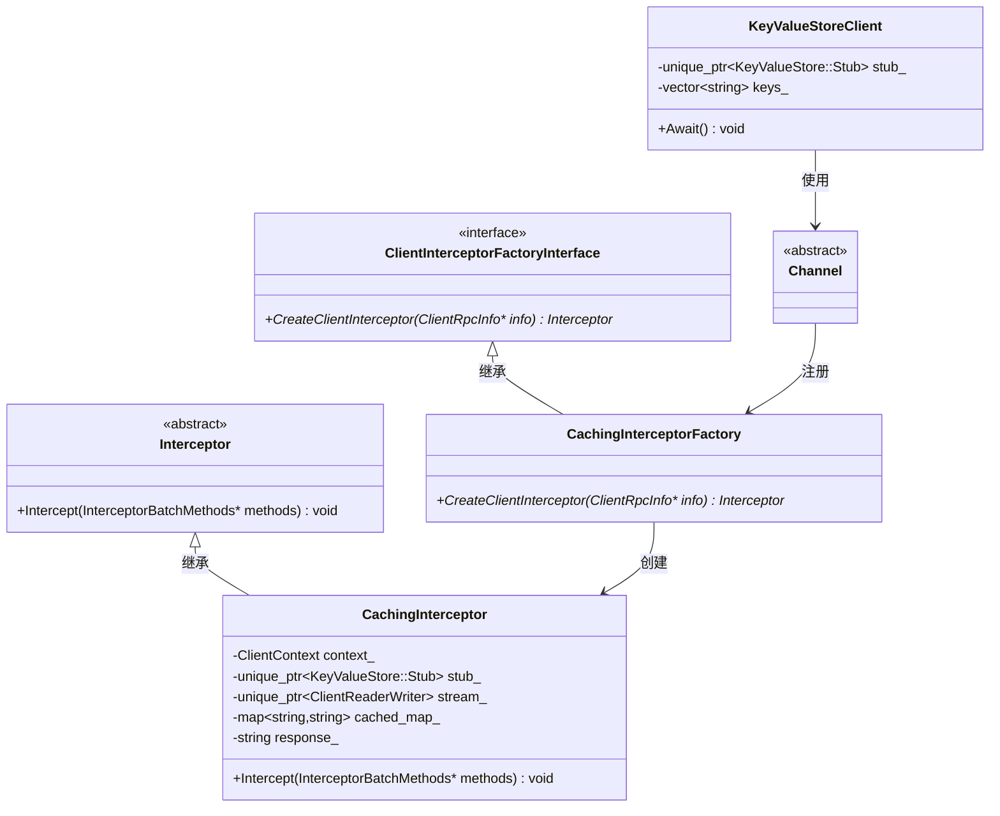

# 客户端拦截器相关类图

```mermaid
classDiagram
    class ClientInterceptorFactoryInterface {
        <<interface>>
        +CreateClientInterceptor(ClientRpcInfo* info) Interceptor*
    }

    class CachingInterceptorFactory {
        +CreateClientInterceptor(ClientRpcInfo* info) Interceptor*
    }

    class Interceptor {
        <<abstract>>
        +Intercept(InterceptorBatchMethods* methods) void
    }

    class CachingInterceptor {
        -ClientContext context_
        -unique_ptr~KeyValueStore::Stub~ stub_
        -unique_ptr~ClientReaderWriter~ stream_
        -map~string,string~ cached_map_
        -string response_
        +Intercept(InterceptorBatchMethods* methods) void
    }

    class Channel {
        <<abstract>>
    }

    class KeyValueStoreClient {
        -unique_ptr~KeyValueStore::Stub~ stub_
        -vector~string~ keys_
        +Await() void
    }

    ClientInterceptorFactoryInterface <|-- CachingInterceptorFactory : 继承
    Interceptor <|-- CachingInterceptor : 继承
    CachingInterceptorFactory --> CachingInterceptor : 创建
    KeyValueStoreClient --> Channel : 使用
    Channel --> CachingInterceptorFactory : 注册
```

# 拦截器生命周期时序图

```mermaid
sequenceDiagram
    autonumber
    participant Main as main()
    participant Client as KeyValueStoreClient<br/>(BidiReactor)
    participant Framework as gRPC Framework
    participant Factory as CachingInterceptorFactory
    participant Interceptor as CachingInterceptor
    participant Server as Server<br/>(via interceptor内部stream)

    %% ========== 初始化阶段 ==========
    rect rgb(230, 245, 255)
        Note over Main,Factory: 初始化阶段
        Main->>Factory: make_unique<CachingInterceptorFactory>()
        Main->>Framework: CreateCustomChannelWithInterceptors()<br/>注册拦截器工厂到Channel
        Main->>Client: 构造 KeyValueStoreClient(channel, keys)
        Client->>Framework: stub_->async()->GetValues(&context_, this)
    end

    %% ========== 拦截器创建 ==========
    rect rgb(255, 245, 220)
        Note over Framework,Interceptor: 拦截器实例创建（per-call）
        Framework->>Factory: CreateClientInterceptor(info)
        Factory->>Interceptor: new CachingInterceptor(info)
        Factory-->>Framework: 返回 Interceptor*
    end

    %% ========== StartCall ==========
    rect rgb(220, 255, 220)
        Note over Client,Server: StartCall — 发起RPC调用
        Client->>Framework: StartWrite(&request_[key1])
        Client->>Framework: StartCall()
        Framework->>Interceptor: Intercept() [PRE_SEND_INITIAL_METADATA]
        Note right of Interceptor: hijack = true<br/>创建内部 stub_ 和 stream_<br/>（用于真正与Server通信）
        Interceptor->>Server: NewStub() + GetValues() 建立内部流
        Interceptor->>Framework: methods->Hijack()<br/>劫持此RPC，后续不再发往原始Channel
    end

    %% ========== key1: 缓存未命中 ==========
    rect rgb(255, 230, 230)
        Note over Client,Server: key1 — 缓存未命中 (cache miss)
        Framework->>Interceptor: Intercept() [PRE_SEND_MESSAGE]
        Note right of Interceptor: 解析请求得到 key="key1"<br/>cached_map_.find("key1") == end()<br/>❌ 缓存未命中
        Interceptor->>Server: stream_->Write(req{key1})
        Server-->>Interceptor: stream_->Read(&resp) → value1
        Note right of Interceptor: cached_map_["key1"] = "value1"
        Interceptor->>Framework: methods->Proceed()

        Framework->>Client: OnWriteDone(ok=true)
        Client->>Framework: StartRead(&response_)

        Framework->>Interceptor: Intercept() [PRE_RECV_MESSAGE]
        Note right of Interceptor: resp->set_value("value1")<br/>将缓存的response_填入返回消息
        Interceptor->>Framework: methods->Proceed()

        Framework->>Client: OnReadDone(ok=true)
        Note left of Client: 输出: key1 : value1<br/>counter_++ → 1
    end

    %% ========== key2~key5 省略 ==========
    rect rgb(245, 245, 245)
        Note over Client,Server: key2, key3, key4, key5 — 同理，缓存未命中，流程相同（省略）
        Client-->>Framework: ...
        Framework-->>Interceptor: ...
        Interceptor-->>Server: ...
        Note right of Interceptor: cached_map_ 现在包含:<br/>key1→value1, key2→value2<br/>key3→value3, key4→value4<br/>key5→value5
    end

    %% ========== key1(重复): 缓存命中 ==========
    rect rgb(220, 255, 220)
        Note over Client,Server: key1(重复) — 缓存命中 ✅ (cache hit)
        Client->>Framework: StartWrite(&request_[key1])
        Framework->>Interceptor: Intercept() [PRE_SEND_MESSAGE]
        Note right of Interceptor: cached_map_.find("key1") != end()<br/>✅ 缓存命中！<br/>response_ = "value1"<br/>⚠️ 不向Server发送请求
        Interceptor->>Framework: methods->Proceed()

        Framework->>Client: OnWriteDone(ok=true)
        Client->>Framework: StartRead(&response_)

        Framework->>Interceptor: Intercept() [PRE_RECV_MESSAGE]
        Note right of Interceptor: resp->set_value("value1")<br/>直接使用缓存值
        Interceptor->>Framework: methods->Proceed()

        Framework->>Client: OnReadDone(ok=true)
        Note left of Client: 输出: key1 : value1 (来自缓存)
    end

    %% ========== key2(重复): 缓存命中 ==========
    rect rgb(220, 255, 220)
        Note over Client,Server: key2(重复), key4(重复) — 同理，缓存命中（省略）
        Client-->>Framework: ...
        Framework-->>Interceptor: ...
        Note right of Interceptor: ✅ 缓存命中，不访问Server
    end

    %% ========== 关闭阶段 ==========
    rect rgb(240, 230, 255)
        Note over Client,Server: 关闭阶段
        Client->>Framework: StartWritesDone()

        Framework->>Interceptor: Intercept() [PRE_SEND_CLOSE]
        Note right of Interceptor: stream_->WritesDone()<br/>关闭内部写入流
        Interceptor->>Framework: methods->Proceed()

        Framework->>Interceptor: Intercept() [PRE_RECV_STATUS]
        Note right of Interceptor: *status = grpc::Status::OK
        Interceptor->>Framework: methods->Proceed()

        Framework->>Client: OnDone(Status::OK)
        Note left of Client: done_ = true<br/>cv_.notify_all()
    end

    %% ========== 销毁阶段 ==========
    rect rgb(255, 225, 225)
        Note over Main,Interceptor: 销毁阶段
        Client->>Main: Await() 返回
        Note over Interceptor: gRPC Framework 销毁<br/>CachingInterceptor 实例<br/>(delete, per-call生命周期结束)
        Note over Factory: CachingInterceptorFactory<br/>随 Channel 销毁而销毁
    end
```