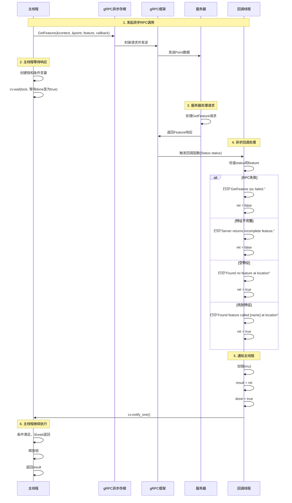
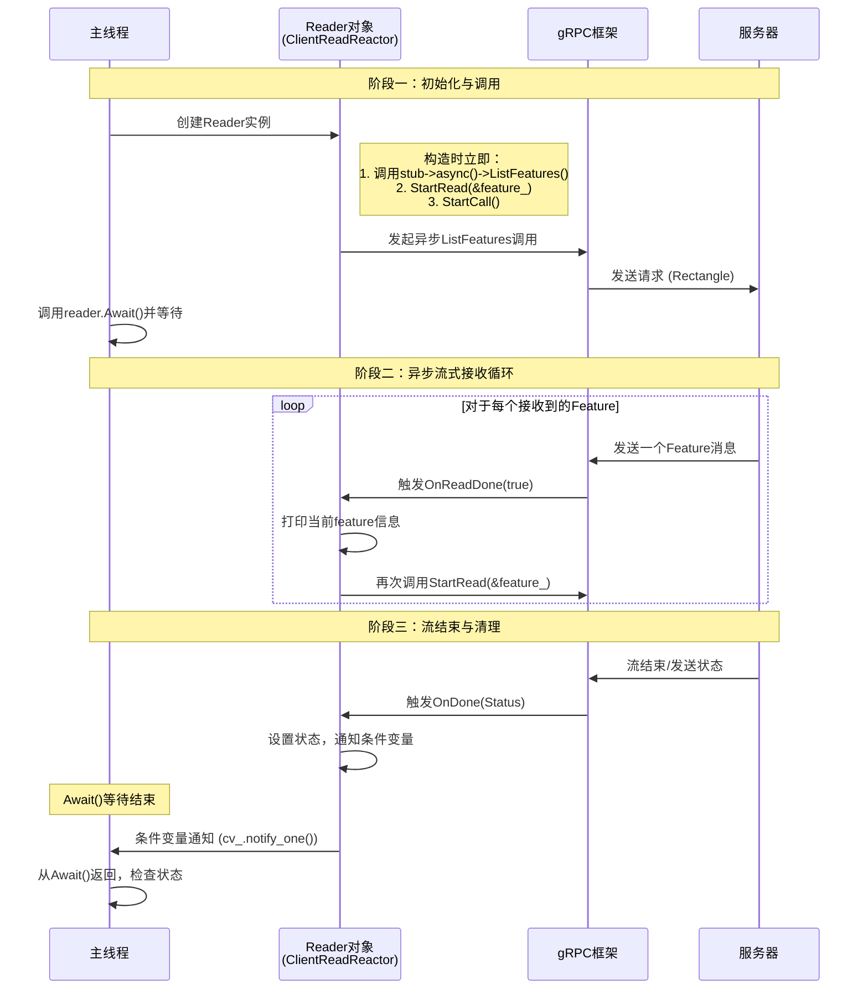
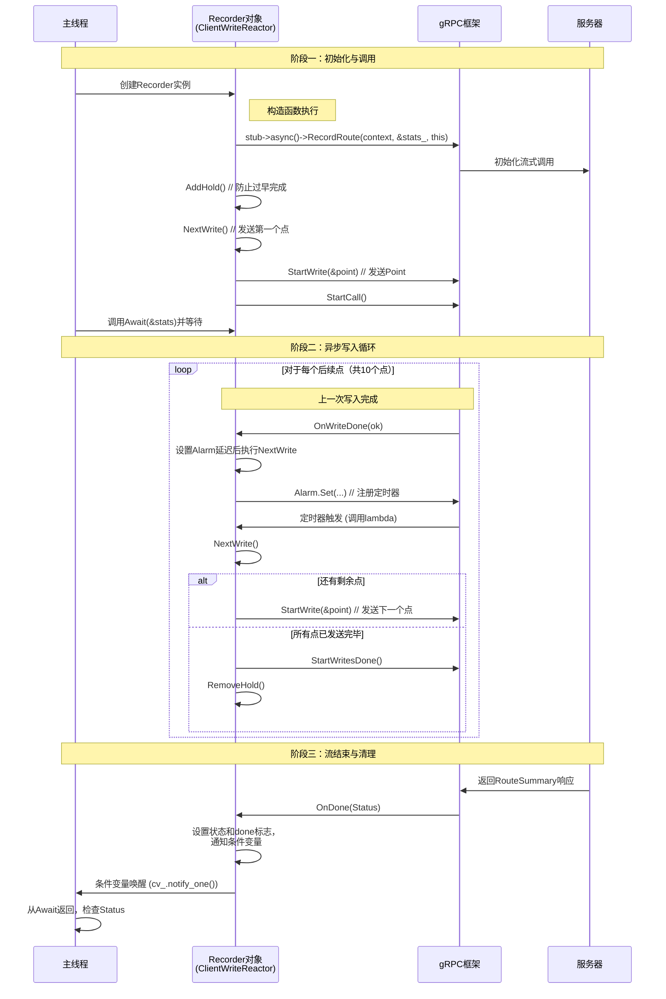
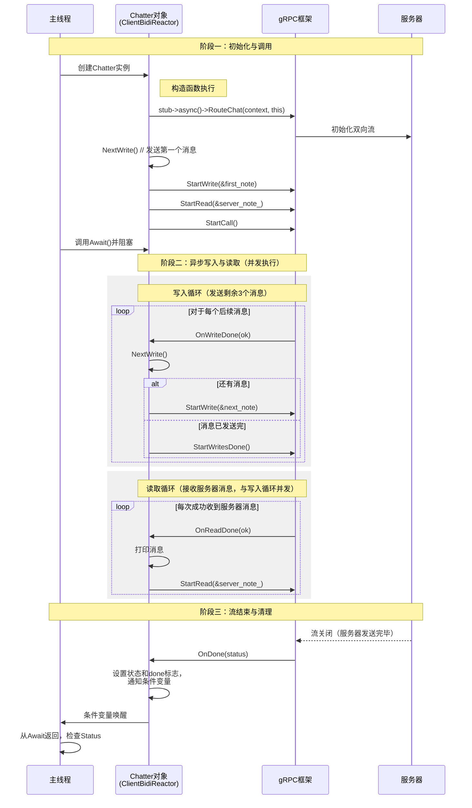

# 一元RPC(Unary RPC)

```mermaid
sequenceDiagram
    participant MainThread as 主线程
    participant AsyncStub as gRPC异步存根
    participant Framework as gRPC框架
    participant Server as 服务器
    participant CallbackThread as 回调线程

    Note over MainThread, CallbackThread: 1. 发起异步RPC调用
    MainThread->>AsyncStub: GetFeature(&context, &point, feature, callback)
    AsyncStub->>Framework: 封装请求并发送
    Framework->>Server: 发送Point数据
    
    Note over MainThread: 2. 主线程等待响应
    MainThread->>MainThread: 创建锁和条件变量
    MainThread->>MainThread: cv.wait(lock, 等待done变为true)
    
    Note over Server: 3. 服务器处理请求
    Server->>Server: 处理GetFeature请求
    Server->>Framework: 返回Feature响应
    
    Note over CallbackThread: 4. 异步回调处理
    Framework->>CallbackThread: 触发回调函数(Status status)
    CallbackThread->>CallbackThread: 检查status和feature
    alt RPC失败
        CallbackThread->>CallbackThread: 打印"GetFeature rpc failed."
        CallbackThread->>CallbackThread: ret = false
    else 特征不完整
        CallbackThread->>CallbackThread: 打印"Server returns incomplete feature."
        CallbackThread->>CallbackThread: ret = false
    else 空特征
        CallbackThread->>CallbackThread: 打印"Found no feature at location"
        CallbackThread->>CallbackThread: ret = true
    else 找到特征
        CallbackThread->>CallbackThread: 打印"Found feature called [name] at location"
        CallbackThread->>CallbackThread: ret = true
    end
    
    Note over CallbackThread: 5. 通知主线程
    CallbackThread->>CallbackThread: 加锁(mu)
    CallbackThread->>CallbackThread: result = ret
    CallbackThread->>CallbackThread: done = true
    CallbackThread->>MainThread: cv.notify_one()
    
    Note over MainThread: 6. 主线程继续执行
    MainThread->>MainThread: 条件满足，从wait返回
    MainThread->>MainThread: 释放锁
    MainThread->>MainThread: 返回result
```

# 服务器端流式 RPC(Server-side streaming RPC)

```mermaid
sequenceDiagram
    participant MainThread as 主线程
    participant Reader as Reader对象<br>(ClientReadReactor)
    participant gRPCFramework as gRPC框架
    participant Server as 服务器

    Note over MainThread, Server: 阶段一：初始化与调用
    MainThread->>Reader: 创建Reader实例
    Note right of Reader: 构造时立即：<br>1. 调用stub->async()->ListFeatures()<br>2. StartRead(&feature_)<br>3. StartCall()
    Reader->>gRPCFramework: 发起异步ListFeatures调用
    gRPCFramework->>Server: 发送请求 (Rectangle)
    MainThread->>MainThread: 调用reader.Await()并等待

    Note over MainThread, Server: 阶段二：异步流式接收循环
    loop 对于每个接收到的Feature
        Server->>gRPCFramework: 发送一个Feature消息
        gRPCFramework->>Reader: 触发OnReadDone(true)
        Reader->>Reader: 打印当前feature信息
        Reader->>gRPCFramework: 再次调用StartRead(&feature_)
    end

    Note over MainThread, Server: 阶段三：流结束与清理
    Server->>gRPCFramework: 流结束/发送状态
    gRPCFramework->>Reader: 触发OnDone(Status)
    Reader->>Reader: 设置状态，通知条件变量
    Note over MainThread: Await()等待结束
    Reader->>MainThread: 条件变量通知 (cv_.notify_one())
    MainThread->>MainThread: 从Await()返回，检查状态
```

# 客户端流式传输RPC(Client-side streaming RPC)

```mermaid
sequenceDiagram
    participant MainThread as 主线程
    participant Recorder as Recorder对象<br>(ClientWriteReactor)
    participant gRPC as gRPC框架
    participant Server as 服务器

    Note over MainThread, Server: 阶段一：初始化与调用
    MainThread->>Recorder: 创建Recorder实例
    Note right of Recorder: 构造函数执行
    Recorder->>gRPC: stub->async()->RecordRoute(context, &stats_, this)
    gRPC->>Server: 初始化流式调用
    Recorder->>Recorder: AddHold()  // 防止过早完成
    Recorder->>Recorder: NextWrite()  // 发送第一个点
    Recorder->>gRPC: StartWrite(&point)  // 发送Point
    Recorder->>gRPC: StartCall()
    MainThread->>Recorder: 调用Await(&stats)并等待

    Note over MainThread, Server: 阶段二：异步写入循环
    loop 对于每个后续点（共10个点）
        Note over gRPC,Recorder: 上一次写入完成
        gRPC->>Recorder: OnWriteDone(ok)
        Recorder->>Recorder: 设置Alarm延迟后执行NextWrite
        Recorder->>gRPC: Alarm.Set(...)  // 注册定时器
        gRPC->>Recorder: 定时器触发 (调用lambda)
        Recorder->>Recorder: NextWrite()
        alt 还有剩余点
            Recorder->>gRPC: StartWrite(&point)  // 发送下一个点
        else 所有点已发送完毕
            Recorder->>gRPC: StartWritesDone()
            Recorder->>Recorder: RemoveHold()
        end
    end

    Note over MainThread, Server: 阶段三：流结束与清理
    Server->>gRPC: 返回RouteSummary响应
    gRPC->>Recorder: OnDone(Status)
    Recorder->>Recorder: 设置状态和done标志，<br>通知条件变量
    Recorder->>MainThread: 条件变量唤醒 (cv_.notify_one())
    MainThread->>MainThread: 从Await返回，检查Status
```

# 双向流式 RPC(Bidirectional streaming RPC)

```mermaid
sequenceDiagram
    participant MainThread as 主线程
    participant Chatter as Chatter对象<br>(ClientBidiReactor)
    participant gRPC as gRPC框架
    participant Server as 服务器

    Note over MainThread, Server: 阶段一：初始化与调用
    MainThread->>Chatter: 创建Chatter实例
    Note right of Chatter: 构造函数执行
    Chatter->>gRPC: stub->async()->RouteChat(context, this)
    gRPC->>Server: 初始化双向流
    Chatter->>Chatter: NextWrite()  // 发送第一个消息
    Chatter->>gRPC: StartWrite(&first_note)
    Chatter->>gRPC: StartRead(&server_note_)
    Chatter->>gRPC: StartCall()
    MainThread->>Chatter: 调用Await()并阻塞

    Note over Chatter, gRPC: 阶段二：异步写入与读取（并发执行）

    rect rgb(240, 240, 240)
        Note over Chatter, gRPC: 写入循环（发送剩余3个消息）
        loop 对于每个后续消息
            gRPC->>Chatter: OnWriteDone(ok)
            Chatter->>Chatter: NextWrite()
            alt 还有消息
                Chatter->>gRPC: StartWrite(&next_note)
            else 消息已发送完
                Chatter->>gRPC: StartWritesDone()
            end
        end
    end

    rect rgb(240, 240, 240)
        Note over Chatter, gRPC: 读取循环（接收服务器消息，与写入循环并发）
        loop 每次成功收到服务器消息
            gRPC->>Chatter: OnReadDone(ok)
            Chatter->>Chatter: 打印消息
            Chatter->>gRPC: StartRead(&server_note_)
        end
    end

    Note over MainThread, Server: 阶段三：流结束与清理
    Server-->>gRPC: 流关闭（服务器发送完毕）
    gRPC->>Chatter: OnDone(status)
    Chatter->>Chatter: 设置状态和done标志，<br>通知条件变量
    Chatter->>MainThread: 条件变量唤醒
    MainThread->>MainThread: 从Await返回，检查Status
```