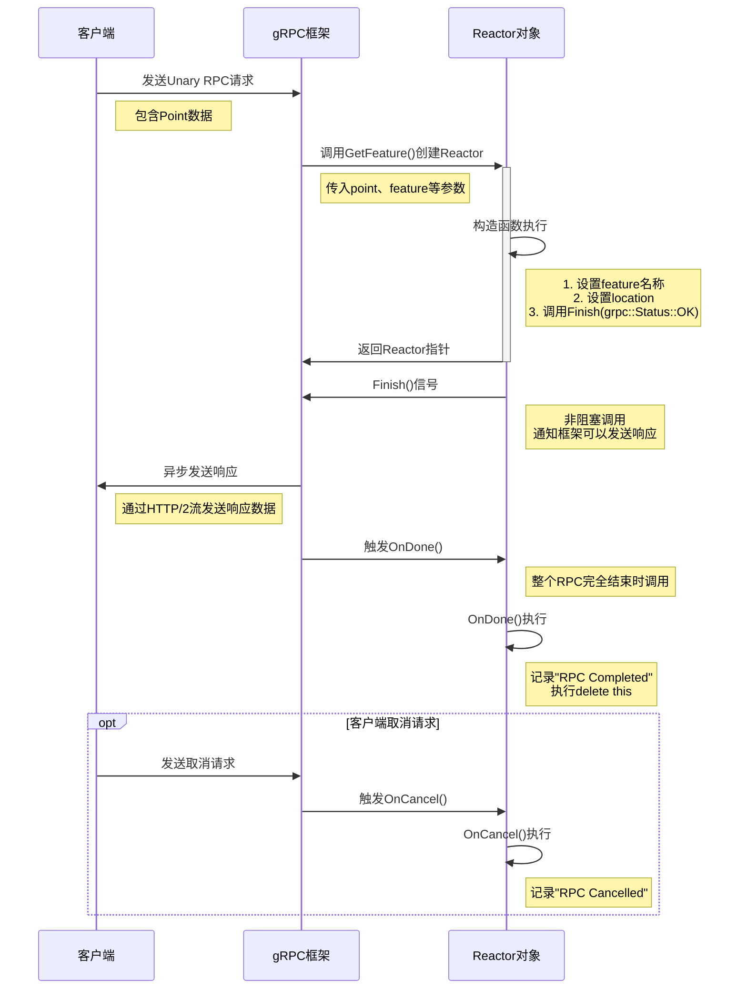
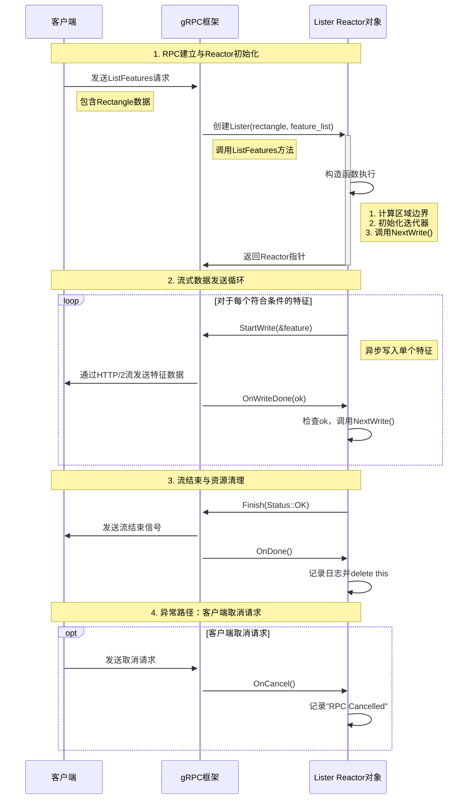

# 一元RPC(Unary RPC)

```mermaid
sequenceDiagram
    participant Client as 客户端
    participant Framework as gRPC框架
    participant Reactor as Reactor对象

    Client->>Framework: 发送Unary RPC请求
    Note right of Client: 包含Point数据
    
    Framework->>+Reactor: 调用GetFeature()创建Reactor
    Note right of Framework: 传入point、feature等参数
    
    Reactor->>Reactor: 构造函数执行
    Note right of Reactor: 1. 设置feature名称<br/>2. 设置location<br/>3. 调用Finish(grpc::Status::OK)
    
    Reactor->>Framework: 返回Reactor指针
    deactivate Reactor
    
    Reactor->>Framework: Finish()信号
    Note right of Reactor: 非阻塞调用<br/>通知框架可以发送响应
    
    Framework->>Client: 异步发送响应
    Note left of Framework: 通过HTTP/2流发送响应数据
    
    Framework->>Reactor: 触发OnDone()
    Note right of Reactor: 整个RPC完全结束时调用
    
    Reactor->>Reactor: OnDone()执行
    Note right of Reactor: 记录"RPC Completed"<br/>执行delete this
    
    opt 客户端取消请求
        Client->>Framework: 发送取消请求
        Framework->>Reactor: 触发OnCancel()
        Reactor->>Reactor: OnCancel()执行
        Note right of Reactor: 记录"RPC Cancelled"
    end
```

# 服务器端流式 RPC(Server-side streaming RPC)

```mermaid
sequenceDiagram
    participant Client as 客户端
    participant Framework as gRPC框架
    participant Reactor as Lister Reactor对象

    Note over Client, Reactor: 1. RPC建立与Reactor初始化
    Client->>+Framework: 发送ListFeatures请求
    Note right of Client: 包含Rectangle数据
    Framework->>+Reactor: 创建Lister(rectangle, feature_list)
    Note right of Framework: 调用ListFeatures方法
    Reactor->>Reactor: 构造函数执行
    Note right of Reactor: 1. 计算区域边界<br/>2. 初始化迭代器<br/>3. 调用NextWrite()
    Reactor->>-Framework: 返回Reactor指针

    Note over Client, Reactor: 2. 流式数据发送循环
    loop 对于每个符合条件的特征
        Reactor->>Framework: StartWrite(&feature)
        Note right of Reactor: 异步写入单个特征
        Framework->>Client: 通过HTTP/2流发送特征数据
        Framework->>Reactor: OnWriteDone(ok)
        Reactor->>Reactor: 检查ok，调用NextWrite()
    end

    Note over Client, Reactor: 3. 流结束与资源清理
    Reactor->>Framework: Finish(Status::OK)
    Framework->>Client: 发送流结束信号
    Framework->>Reactor: OnDone()
    Reactor->>Reactor: 记录日志并delete this

    Note over Client, Reactor: 4. 异常路径：客户端取消请求
    opt 客户端取消请求
        Client->>Framework: 发送取消请求
        Framework->>Reactor: OnCancel()
        Reactor->>Reactor: 记录"RPC Cancelled"
        # 框架可能会终止连接，OnDone可能不会被调用
    end
```